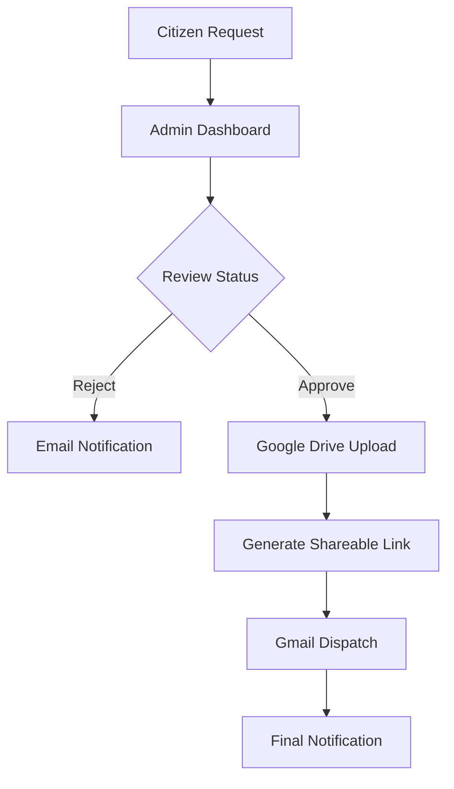

# STAP Hub - Smart Traffic Automation Program

STAP Hub is a professional-grade administrative dashboard designed for smart traffic infrastructure management. It integrates real-time hardware control, CCTV archival requests, traffic data analytics, and automated citizen notifications via Google Workspace.

## 🚀 Quick Start

### Prerequisites
- **Node.js**: v18 or higher.
- **npm**: v9 or higher.
- **Firebase Project**: Service account credentials and client configuration.
- **Google Cloud Console**: OAuth 2.0 credentials with Gmail and Drive API scopes enabled.

### Installation
1. Clone the repository and navigate to the project root.
2. Install dependencies:
   ```bash
   npm install
   ```
3. Configure environment variables (see `.env.example`):
   ```bash
   # Create a .env file with your credentials
   FIREBASE_PROJECT_ID=...
   FIREBASE_CLIENT_EMAIL=...
   FIREBASE_PRIVATE_KEY=...
   GOOGLE_CLIENT_ID=...
   GOOGLE_CLIENT_SECRET=...
   ```

### Running the Application
- **Development Mode**: Starts the Express server and Vite middleware.
  ```bash
  npm run dev
  ```
- **Production Build**: Compiles frontend assets and bundles the backend server.
  ```bash
  npm run build
  npm run start
  ```

## 📦 Project Dependencies

| Category | Libraries |
| :--- | :--- |
| **Core** | React 19, Vite 6, TypeScript 5, Express 4 |
| **Styling** | Tailwind CSS 4, Lucide Icons, Motion (Framer) |
| **Backend** | Google APIs (Gmail/Drive), Firebase Admin, esbuild |
| **Data Viz** | Recharts, jspdf, jspdf-autotable |

## 🛠 System Architecture

### 1. CCTV Footage Request Workflow
This module handles the lifecycle of citizen requests for traffic footage.



### 2. Local Hardware Connectivity
STAP Hub communicates with physical smart poles via a hybrid cloud-to-local bridge.

- **Direct Dispatch**: For local network (Private IP) connections.
- **Cloud Proxy**: For remote management via secure tunnel.

## 📑 API Documentation

### Footage Requests
- **POST `/api/footage-requests/reply`**
  - **Description**: Dispatches an email notification to the requester.
  - **Input**: `{ to: string, subject: string, body: string }`
  - **Output**: `{ success: boolean, messageId: string }`

### Traffic Data
- **POST `/api/v1/upload-ledger`**
  - **Description**: Parses raw traffic CSV data from local sensors.
  - **Input**: Multipart File Upload (CSV)
  - **Output**: `{ success: boolean, filename: string, rowCount: number }`

### Google Workspace Auth
- **GET `/api/auth/google/url`**
  - **Description**: Generates the OAuth consent screen URL.
  - **Output**: `{ url: string }`

- **GET `/api/auth/google/callback`**
  - **Description**: Exchanges authorization code for access/refresh tokens.

## ⚖️ Compliance & Legal
The application includes a built-in **Legal & Compliance Center** (`/LEGAL`) which hosts the:
- **Privacy Policy**: Details on CCTV data retention and Google API usage.
- **Terms of Service**: Governance for administrative access and data extraction.

---
*Maintained by the STAP Development Team. v17.2 Live Control.*
