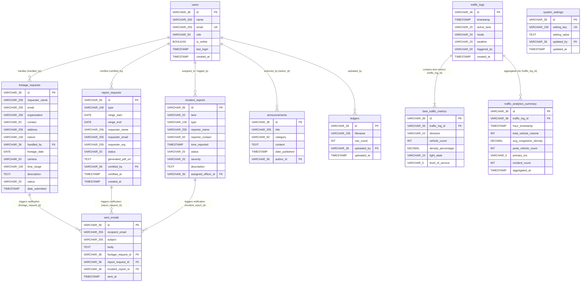

# Database Schema & Relationship Documentation (`SQL.md`)

This document presents the complete relational database schema for **STAP Hub (Smart Traffic Automation Program)**, including normalized relational tables, explicit Foreign Key (`FK`) relationships, indexes, analytics schemas, and a Mermaid ER Diagram for easy rendering on GitHub.

---

## 📊 1. Entity Relationship Diagram (ERD)

Below is the Mermaid visual diagram illustrating all tables and their explicit foreign key relationships:



---

## 🔗 2. Relational Schema & Foreign Key Map

| Table | Foreign Key Column | References Table (PK) | Relationship Type | Operational Purpose |
| :--- | :--- | :--- | :--- | :--- |
| `footage_requests` | `handled_by` | `users(id)` | Many-to-One (`N:1`) | Links citizen CCTV requests to the operator user who reviewed & sent footage. |
| `report_requests` | `certified_by` | `users(id)` | Many-to-One (`N:1`) | Links public certified report orders to the Commissioner/Officer who signed it. |
| `incident_reports` | `assigned_officer_id` | `users(id)` | Many-to-One (`N:1`) | Connects field incidents to the assigned traffic inspector or officer. |
| `announcements` | `author_id` | `users(id)` | Many-to-One (`N:1`) | Identifies the operator/administrator who created a public traffic bulletin. |
| `lane_traffic_metrics` | `traffic_log_id` | `traffic_logs(id)` | Many-to-One (`N:1`) | Stores directional breakdown (North, South, East, West) for each sensor snapshot. |
| `traffic_analytics_summary`| `traffic_log_id` | `traffic_logs(id)` | Many-to-One (`N:1`) | Connects hourly traffic analytics rollup data back to the primary traffic snapshot. |
| `ledgers` | `uploaded_by` | `users(id)` | Many-to-One (`N:1`) | Tracks which user uploaded raw sensor CSV logs into the system. |
| `sent_emails` | `footage_request_id` | `footage_requests(id)` | Many-to-One (`N:1`) | Relates sent email notifications to a specific CCTV footage request. |
| `sent_emails` | `report_request_id` | `report_requests(id)` | Many-to-One (`N:1`) | Relates sent email notifications to a specific report request. |
| `sent_emails` | `incident_report_id` | `incident_reports(id)` | Many-to-One (`N:1`) | Relates dispatched notifications to a specific traffic incident. |
| `system_settings` | `updated_by` | `users(id)` | Many-to-One (`N:1`) | Tracks the system administrator who last modified hardware/app parameters. |

---

## 💻 3. Raw SQL DDL with Explicit Foreign Keys & Indexes

Below is the complete, raw SQL definition script ready for PostgreSQL, MySQL, or relational SQL visualization engines.

```sql
-- =============================================================================
-- STAP HUB FULL RELATIONAL DATABASE DDL SCHEMA
-- =============================================================================

CREATE DATABASE IF NOT EXISTS stap_hub_db;
USE stap_hub_db;

-- -----------------------------------------------------------------------------
-- 1. USERS TABLE
-- -----------------------------------------------------------------------------
CREATE TABLE users (
    id VARCHAR(36) PRIMARY KEY,
    name VARCHAR(255) NOT NULL,
    email VARCHAR(255) NOT NULL UNIQUE,
    role VARCHAR(50) NOT NULL CHECK (role IN ('Administrator', 'Traffic Commissioner', 'Operations Analyst', 'Inspector', 'Pending')),
    is_online BOOLEAN DEFAULT FALSE,
    last_login TIMESTAMP NULL,
    created_at TIMESTAMP DEFAULT CURRENT_TIMESTAMP
);

CREATE INDEX idx_users_email ON users(email);
CREATE INDEX idx_users_role ON users(role);

-- -----------------------------------------------------------------------------
-- 2. FOOTAGE REQUESTS TABLE
-- -----------------------------------------------------------------------------
CREATE TABLE footage_requests (
    id VARCHAR(36) PRIMARY KEY,
    requester_name VARCHAR(255) NOT NULL,
    email VARCHAR(255) NOT NULL,
    organization VARCHAR(255),
    contact VARCHAR(50) NOT NULL,
    address VARCHAR(255),
    nature VARCHAR(100) NOT NULL, -- e.g. Academic, Insurance, Investigation
    handled_by VARCHAR(36) NULL,
    footage_date DATE NOT NULL,
    camera VARCHAR(50) NOT NULL, -- e.g. NORTH_CAM, SOUTH_CAM, EAST_CAM, WEST_CAM
    time_range VARCHAR(100) NOT NULL,
    description TEXT,
    status VARCHAR(20) NOT NULL DEFAULT 'PENDING' CHECK (status IN ('PENDING', 'APPROVED', 'REJECTED', 'ARCHIVED')),
    date_submitted TIMESTAMP DEFAULT CURRENT_TIMESTAMP,
    CONSTRAINT fk_footage_handled_by FOREIGN KEY (handled_by) REFERENCES users(id) ON DELETE SET NULL
);

CREATE INDEX idx_footage_status ON footage_requests(status);
CREATE INDEX idx_footage_email ON footage_requests(email);
CREATE INDEX idx_footage_date ON footage_requests(footage_date);

-- -----------------------------------------------------------------------------
-- 3. REPORT REQUESTS TABLE
-- -----------------------------------------------------------------------------
CREATE TABLE report_requests (
    id VARCHAR(36) PRIMARY KEY,
    type VARCHAR(100) NOT NULL,
    range_start DATE NOT NULL,
    range_end DATE NOT NULL,
    requester_name VARCHAR(255) NOT NULL,
    requester_email VARCHAR(255) NOT NULL,
    requester_org VARCHAR(255),
    status VARCHAR(20) NOT NULL DEFAULT 'PENDING' CHECK (status IN ('PENDING', 'ONGOING', 'APPROVED', 'REJECTED')),
    generated_pdf_url TEXT NULL,
    certified_by VARCHAR(36) NULL,
    certified_at TIMESTAMP NULL,
    created_at TIMESTAMP DEFAULT CURRENT_TIMESTAMP,
    CONSTRAINT fk_report_certified_by FOREIGN KEY (certified_by) REFERENCES users(id) ON DELETE SET NULL
);

CREATE INDEX idx_report_status ON report_requests(status);
CREATE INDEX idx_report_created ON report_requests(created_at);

-- -----------------------------------------------------------------------------
-- 4. INCIDENT REPORTS TABLE
-- -----------------------------------------------------------------------------
CREATE TABLE incident_reports (
    id VARCHAR(36) PRIMARY KEY,
    lane VARCHAR(20) NOT NULL CHECK (lane IN ('NORTH', 'SOUTH', 'EAST', 'WEST', 'ALL')),
    type VARCHAR(100) NOT NULL, -- e.g. Collision, Vehicle Stall, Debris, Signal Failure
    reporter_name VARCHAR(255) NOT NULL,
    reporter_contact VARCHAR(50),
    time_reported TIMESTAMP DEFAULT CURRENT_TIMESTAMP,
    status VARCHAR(20) NOT NULL DEFAULT 'ACTIVE' CHECK (status IN ('ACTIVE', 'CLEARING', 'RESOLVED')),
    severity VARCHAR(20) NOT NULL DEFAULT 'MEDIUM' CHECK (severity IN ('LOW', 'MEDIUM', 'HIGH', 'CRITICAL')),
    description TEXT,
    assigned_officer_id VARCHAR(36) NULL,
    CONSTRAINT fk_incident_assigned_officer FOREIGN KEY (assigned_officer_id) REFERENCES users(id) ON DELETE SET NULL
);

CREATE INDEX idx_incidents_status ON incident_reports(status);
CREATE INDEX idx_incidents_severity ON incident_reports(severity);

-- -----------------------------------------------------------------------------
-- 5. ANNOUNCEMENTS TABLE
-- -----------------------------------------------------------------------------
CREATE TABLE announcements (
    id VARCHAR(36) PRIMARY KEY,
    title VARCHAR(255) NOT NULL,
    category VARCHAR(50) NOT NULL, -- e.g. Roadwork, Advisory, Maintenance
    content TEXT NOT NULL,
    date_published TIMESTAMP DEFAULT CURRENT_TIMESTAMP,
    author_id VARCHAR(36) NULL,
    CONSTRAINT fk_announcements_author FOREIGN KEY (author_id) REFERENCES users(id) ON DELETE SET NULL
);

CREATE INDEX idx_announcements_category ON announcements(category);

-- -----------------------------------------------------------------------------
-- 6. TRAFFIC LOGS TABLE (PRIMARY REAL-TIME SNAPSHOTS)
-- -----------------------------------------------------------------------------
CREATE TABLE traffic_logs (
    id VARCHAR(36) PRIMARY KEY,
    timestamp TIMESTAMP NOT NULL DEFAULT CURRENT_TIMESTAMP,
    active_lane VARCHAR(20) NOT NULL CHECK (active_lane IN ('NORTH', 'SOUTH', 'EAST', 'WEST')),
    mode VARCHAR(20) NOT NULL DEFAULT 'AUTO' CHECK (mode IN ('AUTO', 'MANUAL', 'HAZARD', 'EMERGENCY')),
    weather VARCHAR(20) NOT NULL DEFAULT 'SUNNY' CHECK (weather IN ('SUNNY', 'RAINY', 'FOGGY', 'STORMY')),
    triggered_by VARCHAR(50) DEFAULT 'YOLO API',
    created_at TIMESTAMP DEFAULT CURRENT_TIMESTAMP
);

CREATE INDEX idx_traffic_timestamp ON traffic_logs(timestamp);
CREATE INDEX idx_traffic_mode ON traffic_logs(mode);

-- -----------------------------------------------------------------------------
-- 7. LANE TRAFFIC METRICS TABLE (DIRECTIONAL BREAKDOWN)
-- -----------------------------------------------------------------------------
CREATE TABLE lane_traffic_metrics (
    id VARCHAR(36) PRIMARY KEY,
    traffic_log_id VARCHAR(36) NOT NULL,
    direction VARCHAR(10) NOT NULL CHECK (direction IN ('NORTH', 'SOUTH', 'EAST', 'WEST')),
    vehicle_count INT NOT NULL DEFAULT 0,
    density_percentage DECIMAL(5, 2) NOT NULL DEFAULT 0.00,
    light_state VARCHAR(10) NOT NULL DEFAULT 'RED' CHECK (light_state IN ('RED', 'YELLOW', 'GREEN')),
    level_of_service VARCHAR(5) NOT NULL DEFAULT 'A' CHECK (level_of_service IN ('A', 'B', 'C', 'D', 'E', 'F')),
    CONSTRAINT fk_lane_metrics_traffic_log FOREIGN KEY (traffic_log_id) REFERENCES traffic_logs(id) ON DELETE CASCADE
);

CREATE INDEX idx_lane_metrics_log_id ON lane_traffic_metrics(traffic_log_id);
CREATE INDEX idx_lane_metrics_direction ON lane_traffic_metrics(direction);

-- -----------------------------------------------------------------------------
-- 8. TRAFFIC ANALYTICS SUMMARY TABLE (HOURLY / DAILY ROLLUPS)
-- -----------------------------------------------------------------------------
CREATE TABLE traffic_analytics_summary (
    id VARCHAR(36) PRIMARY KEY,
    traffic_log_id VARCHAR(36) NULL,
    hour_timestamp TIMESTAMP NOT NULL,
    total_vehicle_volume INT NOT NULL DEFAULT 0,
    avg_congestion_density DECIMAL(5, 2) NOT NULL DEFAULT 0.00,
    peak_vehicle_count INT NOT NULL DEFAULT 0,
    primary_los VARCHAR(5) DEFAULT 'B',
    incident_count INT DEFAULT 0,
    aggregated_at TIMESTAMP DEFAULT CURRENT_TIMESTAMP,
    CONSTRAINT fk_analytics_traffic_log FOREIGN KEY (traffic_log_id) REFERENCES traffic_logs(id) ON DELETE CASCADE
);

CREATE INDEX idx_analytics_hour ON traffic_analytics_summary(hour_timestamp);

-- -----------------------------------------------------------------------------
-- 9. LEDGERS TABLE (RAW UPLOADED TRAFFIC DATASETS)
-- -----------------------------------------------------------------------------
CREATE TABLE ledgers (
    id VARCHAR(36) PRIMARY KEY,
    filename VARCHAR(255) NOT NULL,
    row_count INT NOT NULL DEFAULT 0,
    uploaded_by VARCHAR(36) NULL,
    uploaded_at TIMESTAMP DEFAULT CURRENT_TIMESTAMP,
    CONSTRAINT fk_ledgers_uploaded_by FOREIGN KEY (uploaded_by) REFERENCES users(id) ON DELETE SET NULL
);

-- -----------------------------------------------------------------------------
-- 10. SENT EMAILS TABLE (GOOGLE WORKSPACE AUDIT LOG)
-- -----------------------------------------------------------------------------
CREATE TABLE sent_emails (
    id VARCHAR(36) PRIMARY KEY,
    recipient_email VARCHAR(255) NOT NULL,
    subject VARCHAR(255) NOT NULL,
    body TEXT NOT NULL,
    footage_request_id VARCHAR(36) NULL,
    report_request_id VARCHAR(36) NULL,
    incident_report_id VARCHAR(36) NULL,
    sent_at TIMESTAMP DEFAULT CURRENT_TIMESTAMP,
    CONSTRAINT fk_emails_footage FOREIGN KEY (footage_request_id) REFERENCES footage_requests(id) ON DELETE SET NULL,
    CONSTRAINT fk_emails_report FOREIGN KEY (report_request_id) REFERENCES report_requests(id) ON DELETE SET NULL,
    CONSTRAINT fk_emails_incident FOREIGN KEY (incident_report_id) REFERENCES incident_reports(id) ON DELETE SET NULL
);

CREATE INDEX idx_emails_recipient ON sent_emails(recipient_email);

-- -----------------------------------------------------------------------------
-- 11. SYSTEM SETTINGS TABLE
-- -----------------------------------------------------------------------------
CREATE TABLE system_settings (
    id VARCHAR(36) PRIMARY KEY,
    setting_key VARCHAR(100) NOT NULL UNIQUE,
    setting_value TEXT NOT NULL,
    updated_by VARCHAR(36) NULL,
    updated_at TIMESTAMP DEFAULT CURRENT_TIMESTAMP ON UPDATE CURRENT_TIMESTAMP,
    CONSTRAINT fk_settings_updated_by FOREIGN KEY (updated_by) REFERENCES users(id) ON DELETE SET NULL
);
```

---
*Generated for STAP Hub GitHub Documentation. Fully compatible with standard SQL, PostgreSQL, MySQL, and database visualizers.*
